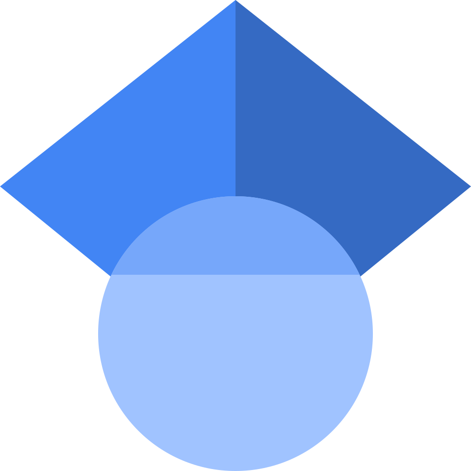

<h1 align="center">Hi 👋, I'm Suvrat Ketkar</h1>

             

# 🌟 About Me:
I'm a **Data Engineeing Intern at Wissen Technology**. I am passionate about developing AI driven web applications and scalable web solutions. I have experience woking with **Python and Node.js**.

# 🔗 Connect with Me:
<table>
  <tr>
    <td></td>
    <td><a href="https://linkedin.com/in/suvrat-ketkar" target="_blank"><b>LinkedIn Profile</b></a></td>
  </tr>
  <tr>
    <td></td>
    <td><a href="https://scholar.google.com/citations?user=YZHOJbYAAAAJ" target="_blank"><b>Google Scholar Profile</b></a></td>
  </tr>
  <tr>
    <td></td>
    <td><a href="https://instagram.com/suvratketkar_4" target="_blank"><b>Instagram Profile</b></a></td>
  </tr>
  <tr>
    <td></td>
    <td><a href="https://github.com/suvrat-ketkar" target="_blank"><b>GitHub Profile</b></a></td>
  </tr>
</table>

# 💻 Tech Stack:

 

# 🌟 My Projects:

### 💡 Scalp Smart
- An AI-powered platform for predicting baldness stages and recommending haircare products.
- **🔗 [Project Repository](https://github.com/Suvrat-Ketkar/ScalpSmart)**

### 🌀 Consumer Complaint Analysis
- The project aims to streamline complaint analysis for businesses using **NLP**, helping them identify trends and improve customer satisfaction
- **🔗 [Project Repository](https://github.com/Suvrat-Ketkar/Complaint-Analysis)**

### 🔒 **Express JWT Authentication & Authorization System**
- **Description:** A backend authentication system using **JWT (JSON Web Tokens)** for secure login and role-based access control.  
- **Features:**  
  ✅ Secure token-based authentication  
  ✅ Middleware for role-based access control  
  ✅ Refresh token mechanism  
- **Tech Stack:** Node.js, Express, JWT, MongoDB, React  
- **🔗 [Project Repository](https://github.com/Suvrat-Ketkar/express-jwt-auth)**

### 🌍 TownSync
- **Description:** A community-driven platform that empowers citizens to report local issues with ease and transparency.
- **📌 Key Features:**  
  ✅ Report issues with image and location tagging  
  ✅ Real-time updates on complaint status  
  ✅ Discover open issues within a 3km radius  
  ✅ Admin panel for authorities to manage and resolve complaints
- **🛠 Tech Stack:** MERN (MongoDB, Express.js, React, Node.js), Google Maps API, JWT Authentication  
- **🔗 [Project Repository](https://github.com/Suvrat-Ketkar/TownSync)**

# 📈 Currently Working On:
### **Community Complaint Management System**
- **Description:** A web app where users can report local issues, track complaint status, and receive updates from authorities.  
- **Tech Stack:** ExpressJS, MongoDB, React, Firebase Cloud Messaging 

# 🏆 Achievements:
- **2nd Runner-up at Impetus and Concepts Hackathon** 🥇
- **Finalist in IBM SkillsBuild Hackathon** 💪
- **Paper accepted at IEEE ICATE-2025 Conference** 🎉

### ✨ Random Dev Quote:

 

